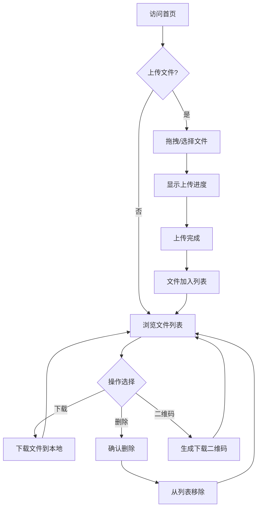

## 1. 产品概述
一个简洁高效的私人文件中转站应用，支持跨设备文件上传和下载，类似微信/QQ的文件传输助手功能。
- 无需登录注册，开箱即用，支持拖拽上传，文件自动过期清理
- 部署在个人云服务器上，实现多设备间便捷文件传输

## 2. 核心功能

### 2.1 用户角色
| 角色 | 使用方式 | 核心权限 |
|------|----------|----------|
| 访客用户 | 直接访问 | 上传文件、下载文件、删除文件 |

### 2.2 功能模块
1. **文件上传页**：拖拽上传区域、文件选择按钮、上传进度显示
2. **文件列表页**：已上传文件列表、文件信息展示、下载/删除操作
3. **文件详情**：文件预览（支持图片）、二维码分享、过期时间设置

### 2.3 页面详情
| 页面名称 | 模块名称 | 功能描述 |
|----------|----------|----------|
| 主页 | 上传区域 | 支持拖拽上传、点击选择文件、显示支持格式和大小限制 |
| 主页 | 上传进度 | 实时显示上传进度条、上传速度、剩余时间 |
| 主页 | 文件列表 | 展示所有已上传文件，包含文件名、大小、上传时间、过期时间 |
| 主页 | 文件操作 | 每个文件提供下载、删除、复制链接、生成二维码按钮 |
| 主页 | 统计信息 | 显示存储空间使用情况、文件数量 |
| 文件预览 | 预览区域 | 图片文件在线预览，其他文件显示图标 |
| 文件预览 | 二维码 | 生成当前文件下载链接的二维码，方便手机扫码下载 |

## 3. 核心流程
用户访问首页后，可直接拖拽或点击上传文件，上传成功后文件显示在列表中；在其他设备上访问同一地址即可看到文件列表并下载；文件可设置过期时间自动删除，也可手动删除。

## 4. 用户界面设计
### 4.1 设计风格
- 主色调：深邃蓝紫色渐变（#667eea 到 #764ba2），搭配浅色背景，现代简约风格
- 按钮样式：圆角卡片式，悬停有微动效和阴影变化
- 字体：使用无衬线字体，标题醒目，正文清晰易读
- 布局风格：居中卡片式布局，顶部为标题和说明，中间为上传区域，下方为文件列表
- 图标风格：使用 Lucide 线性图标，简洁统一

### 4.2 页面设计概览
| 页面名称 | 模块名称 | UI元素 |
|----------|----------|--------|
| 主页 | 顶部标题区 | 渐变背景标题、副标题说明、统计信息小卡片 |
| 主页 | 上传区域 | 大尺寸虚线边框拖拽区域、云朵上传图标、提示文字、点击上传按钮 |
| 主页 | 文件列表 | 卡片式文件项、文件图标、文件名、大小、时间、操作按钮组 |
| 主页 | 空状态 | 简洁插画风格空状态提示、引导上传文字 |
| 文件预览 | 模态框 | 居中弹出、半透明遮罩、关闭按钮、预览内容、二维码 |

### 4.3 响应式设计
- 桌面端优先设计，最大宽度 800px 居中展示
- 平板和移动端自适应，文件列表项垂直排列
- 触摸优化，按钮点击区域足够大
- 小屏幕下二维码自动换行显示

### 4.4 交互动效
- 文件拖拽进入上传区域时有高亮反馈
- 上传进度条平滑动画
- 文件列表项悬停时轻微上浮和阴影加深
- 删除操作有淡出动画
- 按钮点击有按压反馈效果
- 页面加载时元素依次淡入
