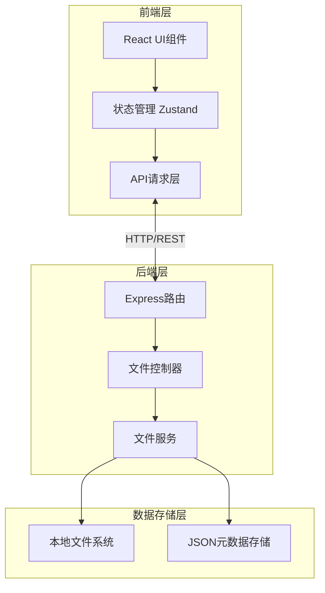
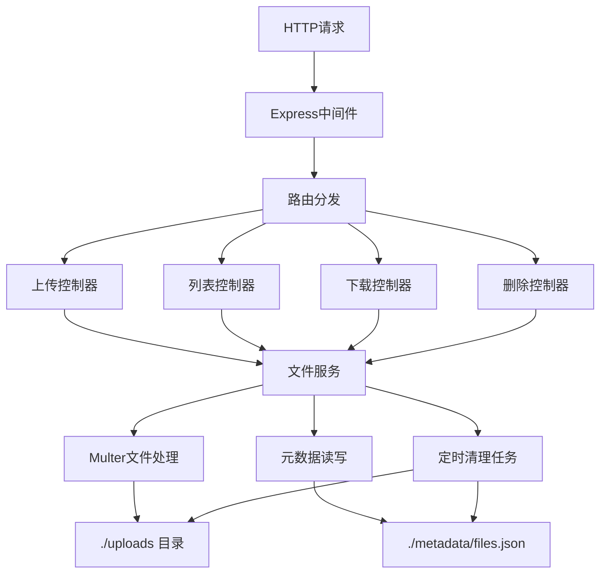
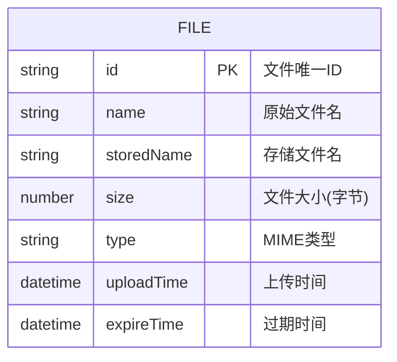

## 1. 架构设计
本项目采用前后端分离架构，前端使用 React + TypeScript + Tailwind CSS，后端使用 Express.js 提供 RESTful API，文件存储在服务器本地文件系统。



## 2. 技术栈说明
- 前端：React@18 + TypeScript + Tailwind CSS@3 + Vite
- 状态管理：Zustand
- 图标库：lucide-react
- 二维码生成：qrcode.react
- 初始化工具：vite-init
- 后端：Express@4 + TypeScript + Multer（文件上传）
- 文件存储：服务器本地文件系统
- 元数据存储：JSON文件（无需数据库，轻量部署）
- 文件过期：定时任务自动清理过期文件

## 3. 路由定义
| 路由 | 用途 |
|------|------|
| / | 主页，包含文件上传和列表 |

## 4. API定义

### 4.1 文件上传
- **POST** `/api/upload`
  - Content-Type: multipart/form-data
  - 请求体：file (文件), expireHours (过期时间小时数，可选)
  - 响应：
    ```typescript
    interface UploadResponse {
      success: boolean;
      file?: {
        id: string;
        name: string;
        size: number;
        type: string;
        uploadTime: string;
        expireTime: string;
      };
      error?: string;
    }
    ```

### 4.2 获取文件列表
- **GET** `/api/files`
  - 响应：
    ```typescript
    interface FileListResponse {
      success: boolean;
      files: Array<{
        id: string;
        name: string;
        size: number;
        type: string;
        uploadTime: string;
        expireTime: string;
      }>;
      stats: {
        totalFiles: number;
        totalSize: number;
      };
    }
    ```

### 4.3 下载文件
- **GET** `/api/download/:id`
  - 响应：文件流，触发浏览器下载

### 4.4 删除文件
- **DELETE** `/api/files/:id`
  - 响应：
    ```typescript
    interface DeleteResponse {
      success: boolean;
      message?: string;
      error?: string;
    }
    ```

### 4.5 预览文件（图片）
- **GET** `/api/preview/:id`
  - 响应：图片文件流

## 5. 服务端架构图


## 6. 数据模型
### 6.1 数据模型定义


### 6.2 元数据存储格式
存储在 `./metadata/files.json`：
```json
{
  "files": [
    {
      "id": "uuid-string",
      "name": "example.pdf",
      "storedName": "uuid-example.pdf",
      "size": 1024000,
      "type": "application/pdf",
      "uploadTime": "2024-01-01T00:00:00.000Z",
      "expireTime": "2024-01-02T00:00:00.000Z"
    }
  ]
}
```

## 7. 部署说明
- 上传文件大小限制：默认 500MB（可配置）
- 文件默认过期时间：24小时（可配置）
- 端口：默认 3000（可配置）
- 启动方式：`npm start` 或使用 PM2 守护进程
